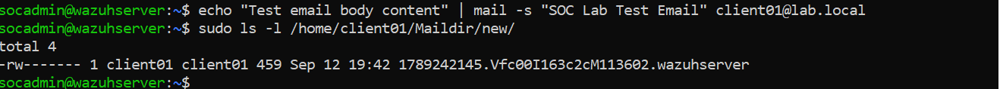
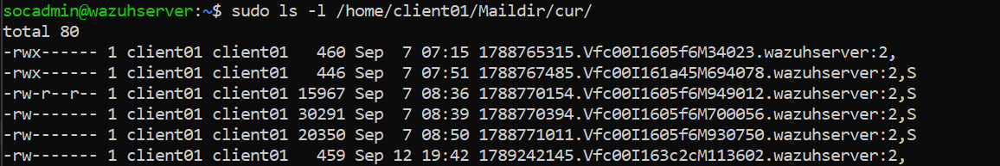
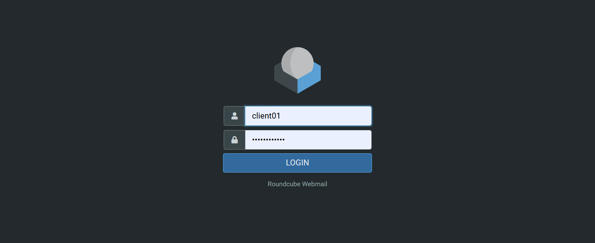
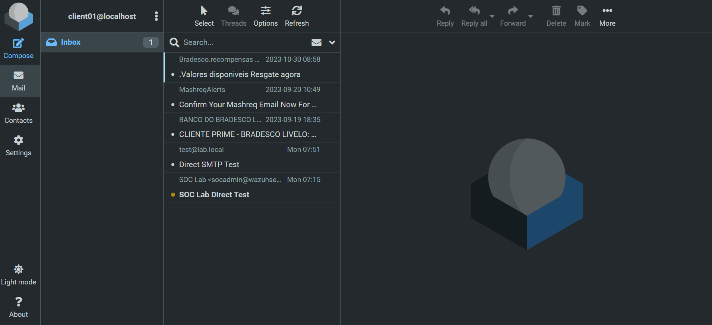
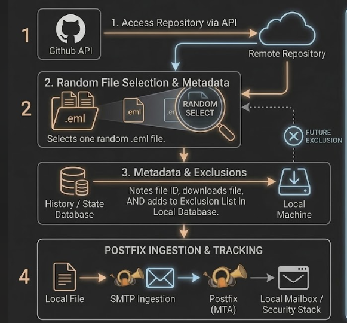
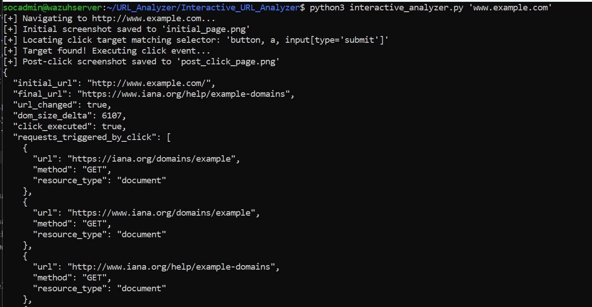
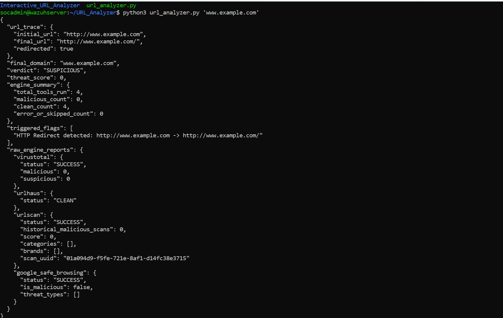

**SOC Simulator - Where you Attack, Simulate, Detect, Triage, and Respond**


<h3>Phase 1: Client Architecture Setup </h3>


<h4> Gateway 1: Postfix MTA Configuration </h4> 

``` python
               SMTP
                 ↓
               Receive/send email
                 ↓
               Deliver message to mailbox
```


<h4> Gate 2: MDA & IMAP Configuration (Dovecot) </h4> 


So now we create a Maildir - which means that all the mails that are stored are stored here by the email server on the disk currently. 

Every file is stored as a seperate text file. Each of those are stored in a directory structure as follows:


```
/home/client01/Maildir/
├── tmp/   <-- Temporary space while an email is actively being delivered
├── new/   <-- Unread emails that just arrived
└── cur/   <-- Emails that have been read or opened
```


The workflow becomes like:

1. Postfix recieves the mail, and writes it inside a <b>/tmp</b> file
2. Once the file is written fully errors, it moves to <b>/tmp</b>
3. Then if the email file is opened, then it goes into <b>/cur</b>

```
# Create Maildir directories for client01
sudo mkdir -p /home/client01/Maildir/{cur,new,tmp}

# Set owner permissions so client01 and Dovecot can write to it
sudo chown -R client01:client01 /home/client01/Maildir
sudo chmod -R 700 /home/client01/Maildir


             Mailbox storage
                   │
                   ▼
                DOVECOT
                   │
                  IMAP
                   │
                   ▼
                 WEBMAIL
```


##### Protocol used here: IMAP

* <b>IMAP</b>: Internet Message Autentication Protocol, is used when users who wish to access the mail server to view the list of messages it recieved. 
* The list of messages recieved can be viewed, and technically every message has certain content which is stored in the server(dovcot)


<h4> Gate 3: Victim Account Provisioning & Direct Delivery Test </h4> 

```
Name:
Client01

Email:
client01@lab.local

Mailbox:
client01
```

Now since our user is created: 

We can send a sample mail via Postfix to see if the mail goes to the Mail Storage(Dovcot) and the the client could then access it.




We see this big long text of random strings is as every new mail represents as a new file and a dedicated string for each new file.

Lets see the list of files the user has opened in the image below.




<h4> Gate 4: Roundcube Webmail Installation & Verification </h4> 

Now time to for the user to access the mail, via the UI which in this case will be that user has access to the mailbox and he interacts with each and every single mail.
This is the planned ouput

```
┌─────────────────────────────────────────────┐
│ Roundcube                                   │
├──────────────┬──────────────────────────────┤
│ Inbox (10)   │                              │
│ Sent         │  ⚠ CLIENTE PRIME...         │
│ Drafts       │    banco.bradesco@...        │
│ Trash        │                              │
│              │  ⚠ Microsoft Account...     │
│              │                              │
└──────────────┴──────────────────────────────┘
```

<b>Results:</b>





---------------


<h3>Phase 2: Phshing Email Extraction & Parsing </h3>

This phase involves sending the mail via the github repository to the user mail box so that once the email arrives, we get to do our own analysis which will be given by initial analysis from Wazuh, Automatic Tool Correlation Analysis like a SOC analyst would need to conclude to a decision if an Email is malacious or not. 

<b>Credit for Github Repository for Phishing Mails:</b> <insert link here>


Every single Mail parsed is from the replay_phish.py file which will access every single .eml file from the repo on a random base, select, note the metadata & exclusion to the history so that while we analyze and practice, we never ever analyze the same mail again, or no new same mail comes to the inbox ever, and goes on to send to the user's inbox. 

##### Workflow:




The <b>MIME parser</b> is simply the component that understands the internal structure of the .eml headers, HTML/plaintext, attachments, MIME boundaries, etc.Now, the replay engine can deliver the email correctly into the simulated client's mailbox.


```
             phishing_001.eml
                     │
                     ▼
               MIME parser
                     │
           ┌─────────┴─────────┐
           │                   │
        Headers              Body
           │                   │
           └─────────┬─────────┘
                     │
                     ▼
              Message builder
                     │
                     ▼
                  Postfix
                     │
                     ▼
          client01@lab.local
                     │
                     ▼
                Dovecot
                     │
                     ▼
                Roundcube
```


<h3>Phase 3: Email Header Analysis Tool & URL Analysis Tool</h3><br>

<b>URL Analysis Tool</b>

This has 2 parts:

<b>1. Interactive URL Analyzer Tool </b>

We have the interactive URL analyzer which helps us automatically run, create snapshots for the phishing websites, helps us also get a list of sites and redirects if it exist's

This helps us also see that how, upon clicking a single url, initially and the true url when the user lands on the actual page if the url has changed or no. 




<b>2. Mannual Interactive Phishing Site Sandbox</b>

<b>Use Case:</b> 
If an analyst wish to see, collect snapshots of each webpage, from each page the user would hypothetically land upon, or rather would get redirected to with respect to the Phishing website, is where this tool comes in handy.


<b>3. Co-Relation Analyzer Tool Depictor (URL_Analyzer) </b>

This tool helps us to do analysis across multiple security vendors tools for url analysis to come to conclusion of correlation


| Tool                 | Focus / Strengths                                           | Free Tier Limits            | Key Data Provided                                                          |
|----------------------|-------------------------------------------------------------|-----------------------------|----------------------------------------------------------------------------|
| URLhaus (abuse.ch)   | Specialized in malware distribution URLs and payloads.      | Unlimited (No key required) | Threat status, malware family names, payload tags.                         |
| URLScan.io           | Dynamic website sandbox analysis.                           | ~1,000 public scans/day     | Screenshot, final redirected URL, DOM elements, brand impersonation flags. |
| Google Safe Browsing | Checks URLs against Google’s global malware/phishing list.  | 10,000 requests/day         | Match types (e.g., MALWARE, SOCIAL_ENGINEERING / Phishing).                |
| PhishTank            | Community-driven crowd-sourced database for phishing sites. | Free API access             | Validated active phishing status.                                          |
|                      |                                                             |                             |                                                                            |





--------


